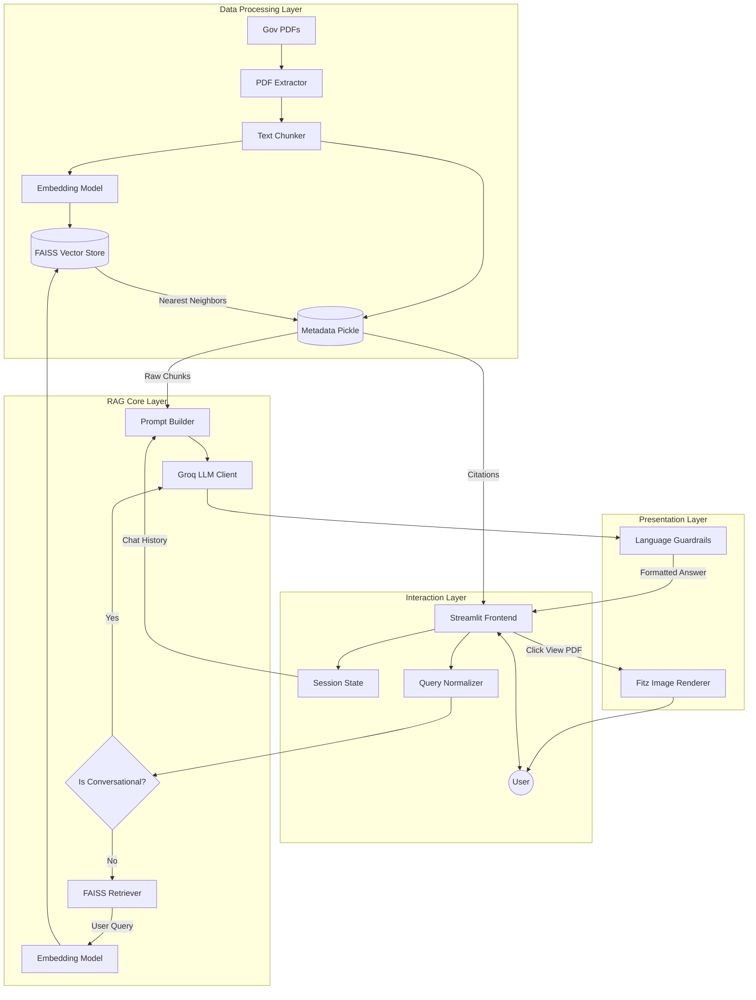

# InfoBridge: Comprehensive System Architecture, Design, and Workflow Documentation

*An exhaustive 12-page equivalent documentation detailing the entire lifecycle, architecture, technical design, and implementation of the InfoBridge Government Services RAG platform.*

---

## Table of Contents
1. [Introduction and Problem Statement](#1-introduction-and-problem-statement)
2. [System Objectives & Feature Scope](#2-system-objectives--feature-scope)
3. [High-Level Architecture (HLD)](#3-high-level-architecture-hld)
4. [Offline Data Ingestion Workflow](#4-offline-data-ingestion-workflow)
5. [Vector Embedding and Storage (FAISS)](#5-vector-embedding-and-storage-faiss)
6. [Online Inference Workflow (RAG)](#6-online-inference-workflow-rag)
7. [LLM Inference & Prompt Engineering](#7-llm-inference--prompt-engineering)
8. [Linguistic Enforcement & Guardrails](#8-linguistic-enforcement--guardrails)
9. [Frontend UI/UX Architecture](#9-frontend-uiux-architecture)
10. [Advanced Technical Features Deep Dive](#10-advanced-technical-features-deep-dive)
11. [Codebase & Directory Hierarchy](#11-codebase--directory-hierarchy)
12. [Conclusion](#12-conclusion)

---

## 1. Introduction and Problem Statement

### 1.1 The Problem
Accessing Indian government services (Passports, Voter IDs, Income Tax, Ayushman Bharat, and Driving Licences) involves navigating hundreds of pages of complex, bureaucratic PDF manuals, circulars, and guidelines. Citizens often struggle to find specific, actionable answers (e.g., "What documents do I need for a Tatkaal passport?") without manually reading extensive legal documentation. Furthermore, standard Large Language Models (LLMs) are prone to "hallucinations" — confidently providing incorrect or outdated governmental procedures, which is unacceptable for civic services.

### 1.2 The InfoBridge Solution
**InfoBridge** solves this by implementing a **Retrieval-Augmented Generation (RAG)** pipeline. Instead of relying on an LLM's pre-trained (and potentially flawed) memory, InfoBridge forces the LLM to read from official, verified PDF documents stored in a highly optimized vector database. The system provides a bilingual (English and Hindi), highly interactive web interface that not only answers the user's queries but also provides verifiable citations and an embedded PDF viewer to prove its accuracy.

---

## 2. System Objectives & Feature Scope

### Core Features:
1. **Semantic Search & RAG**: Accurate document retrieval based on semantic meaning, not just keyword matching.
2. **Bilingual Support**: Full support for English and Hindi (Devanagari) queries and responses, dynamically managed in the UI.
3. **Conversational Memory**: The chatbot remembers the context of the conversation for follow-up queries.
4. **Verifiable Citations**: Every RAG-based answer includes source cards showing the exact document, page number, and FAISS relevance score.
5. **Interactive Inline PDF Viewing**: A robust, Safari/Mobile-safe custom PDF renderer that displays the exact cited page within the chat window without forcing external downloads or crashing browser iframes.
6. **Smart Intent Routing**: Capable of detecting whether a user is asking a document-related question or just saying "Hello", bypassing the heavy RAG pipeline for the latter.
7. **Service Filtering**: Users can restrict searches to specific domains (e.g., only search "Income Tax" documents).

---

## 3. High-Level Architecture (HLD)

The system operates on two distinct, decoupled pipelines:

### 3.1 The Offline Pipeline (Index Building)
This pipeline runs asynchronously before the app starts. It processes static PDFs into a mathematically searchable state.
`Raw PDFs → PyMuPDF Extractor → LangChain Chunker → SentenceTransformers Embedder → FAISS Index`

### 3.2 The Online Pipeline (Real-Time Inference)
This pipeline runs synchronously when a user interacts with the UI.
`User Query → Normalization → Intent Check → Embedder → FAISS Semantic Search → Context Aggregation → Groq LLM Prompting → UI Rendering`

### 3.3 HLD Flow Diagram



---

## 4. Offline Data Ingestion Workflow

To answer questions accurately, InfoBridge must first "read" and organize the government manuals. This is handled by `scripts/build_index.py` which triggers the `src/data_processing` module.

### 4.1 PDF Extraction (`pdf_extractor.py`)
Government PDFs are notoriously difficult to parse. They contain watermarks, tables, scanned images, and decorative symbols. 
1. **Primary Extraction**: InfoBridge uses **PyMuPDF (`fitz`)**, which is significantly faster and more accurate than standard `PyPDF2`.
2. **Quality Heuristics**: As it extracts text page-by-page, it runs a `_is_bad_text()` heuristic. If a page yields fewer than 50 characters or less than 10 words, the system flags it as a scanned image rather than a text document.
3. **OCR Fallback**: If a page is flagged as an image, InfoBridge dynamically attempts to invoke `pytesseract` (Optical Character Recognition) to extract the text visually.
4. **Noise Sanitization**: Extracted text is heavily cleaned using regular expressions. The system strips out:
    * Bracketed CPV division headers.
    * Stray bullet points and decorative symbols (`►`, `⮚`).
    * Extraneous page numbers embedded in the text.
    * Multiple consecutive line breaks.

### 4.2 Semantic Chunking (`chunker.py`)
LLMs have finite context windows, and feeding entire 500-page manuals is impossible. The cleaned text must be sliced into chunks.
1. **Recursive Character Splitting**: InfoBridge uses `langchain_text_splitters.RecursiveCharacterTextSplitter`. It attempts to split text logically (by paragraphs `\n\n`, then sentences `.`, then words) rather than abruptly cutting words in half.
2. **Chunk Sizing**: 
    * `CHUNK_SIZE = 500` characters. This represents roughly 80-120 words, providing a highly specific, dense block of information ideal for focused semantic search.
    * `CHUNK_OVERLAP = 100` characters. This ensures that context isn't lost if a crucial sentence spans the boundary of two chunks.
3. **Garbage Collection**: Any chunk resulting in fewer than 30 words is discarded to keep the vector database pristine and free of useless fragments (like stray headers or footer artifacts).
4. **Metadata Attachment**: Every single chunk is tagged with a `chunk_id`, the `source_file`, the `service_type` (derived from its parent directory), and the exact `page` number it originated from.

---

## 5. Vector Embedding and Storage (FAISS)

### 5.1 The Embedding Model (`embedder.py`)
To make text searchable by meaning (semantics) rather than exact keywords, the chunks are converted into mathematical vectors.
* InfoBridge uses `sentence-transformers/all-MiniLM-L6-v2`.
* **Why this model?** It creates a 384-dimensional dense vector. It is specifically optimized for semantic search, incredibly fast on CPU environments, and has a very small memory footprint compared to larger BERT models.

### 5.2 The FAISS Vector Database (`store.py`)
Once converted to 384D arrays, the vectors are stored in **Facebook AI Similarity Search (FAISS)**.
1. **Index Strategy**: The system uses `faiss.IndexFlatIP` (Inner Product).
2. **Cosine Similarity Optimization**: Before insertion, every vector is explicitly L2 normalized (`query_embedding / np.linalg.norm(query_embedding)`). In vector mathematics, the Inner Product of two L2-normalized vectors is exactly equivalent to their **Cosine Similarity**. This approach is computationally cheaper and highly accurate for text similarity.
3. **Persistence**: FAISS handles the raw C++ vector arrays (`faiss_index.bin`), while a synchronized Python Pickle file (`metadata.pkl`) stores the corresponding text and metadata dictionary for `O(1)` retrieval.

---

## 6. Online Inference Workflow (RAG)

When a user submits a query via the UI, a complex, real-time pipeline is triggered.

### 6.1 Query Normalization & Intent Routing (`generator.py`)
1. **Language & Text Normalization**: The query is lowercased and stripped of excessive whitespace.
2. **Conversational Intent Check**: The query is evaluated against a strict array of Regex patterns (`_CONVERSATIONAL_PATTERNS`). 
    * If the user types "Hello", "Thanks", "What can you do?", or "Bye", the system recognizes this as conversational.
    * If a query is ≤ 4 words AND lacks any government keywords ("passport", "tax", etc.), it is flagged.
    * **Bypass Strategy**: If conversational, the system entirely bypasses the embedding and FAISS search phases. It directly queries the LLM with a specialized `SYSTEM_INSTRUCTION_GENERAL`, saving massive amounts of API tokens and reducing latency by ~60%.

### 6.2 Semantic Retrieval (`retriever.py`)
If the query is recognized as a genuine question (e.g., "What documents do I need for a Tatkaal passport?"):
1. The user's query is passed through the same `all-MiniLM-L6-v2` embedder to generate a 384D query vector.
2. **Vector Search**: FAISS calculates the Cosine Similarity against the entire database.
3. **Filtering**: 
    * `TOP_K = 5` chunks are requested.
    * If the user applied a UI service filter (e.g., "Passport Services Only"), FAISS retrieves `TOP_K * 3` chunks, applies the filter, and yields the top 5 matches belonging *only* to that service category.
    * **Similarity Thresholding**: Any chunk with a similarity score below `0.3` is brutally discarded. This guarantees the LLM doesn't attempt to hallucinate an answer from irrelevant data if the user asks an off-topic question.

### 6.3 Citation Mapping
The retriever maps the FAISS indices back to the metadata. Since a 500-character chunk strategy means multiple chunks might come from the exact same PDF page, the retriever deduplicates them using a unique `(source_file, page, service_type)` tuple, ensuring the UI only displays one source card per page, preserving the highest relevance score.

---

## 7. LLM Inference & Prompt Engineering

### 7.1 The Groq Client (`client.py`)
* **Hardware Accelerated Inference**: InfoBridge connects to the Groq API, which utilizes Language Processing Units (LPUs) rather than GPUs, resulting in generation speeds exceeding 300+ tokens per second.
* **Fallback Cascade Mechanism**: Government platforms demand high availability. If the primary model (`llama3-8b-8192`) throws a `404 Not Found` or `429 Rate Limit` error, the `llmClient` catches the exception and immediately recurses through an array of `FALLBACK_MODELS` (e.g., `llama3-70b-8192`, `mixtral-8x7b-32768`).
* **Catastrophic Failure Handling**: If all LLMs are down or the API key is exhausted, the generator executes `_build_retrieval_fallback()`. It formats the raw text chunks retrieved from FAISS into a readable payload and displays them directly to the user, ensuring the app never "breaks".

### 7.2 Strict Prompt Architecture (`prompts.py`)
InfoBridge does not use simple prompts. It constructs an elaborate string containing four distinct sections:
1. **System Instruction**: Tells the model it is "InfoBridge", commands it to use point-wise structures, prohibits hallucination, and forbids internal meta-references (e.g., "According to the context..."). Crucially, recent updates allow the model to *supplement* answers with its trained knowledge only if the specific granular detail is missing from the retrieved context, eliminating the frustrating "Insufficient Information" loop.
2. **RAG Context**: The raw text aggregated from the top 5 FAISS chunks.
3. **Conversation Memory**: The last `N` turns of the conversation, extracted from `ChatMemory`.
4. **User Query**: The specific question being asked.
5. **Language Guardrail**: A dynamically appended final rule enforcing the output language.

---

## 8. Linguistic Enforcement & Guardrails

India is a multilingual country, and maintaining strict language boundaries is a core technical challenge. InfoBridge guarantees that if the UI is set to Hindi, the output is *strictly* Devanagari Hindi, completely barring Romanized Hindi (Hinglish) or English leakage.

### 8.1 Linguistic Detection Heuristics
Inside `generator.py`, custom string evaluation algorithms run on the LLM's raw output:
* **Hinglish Detection (`_looks_hinglish_romanized`)**: Tokenizes the output and cross-references it against an exact-match dictionary of common Romanized Hindi markers (`mujhe`, `kaise`, `kya`, `banwana`). If the marker threshold is breached, the text is flagged.
* **Devanagari Density (`_is_hindi_output`)**: Iterates through the output string's unicode values. It calculates the ratio of characters falling within the Devanagari Unicode block (`\u0900-\u097F`) against total alphabetical characters. A ratio ≥ 20% confirms valid Hindi.

### 8.2 Auto-Correction Loops
If the user selects English, but asks a question in Hinglish ("passport kaise banwaye?"), an LLM might naturally reply in Hinglish. 
InfoBridge detects this. If the language guardrail fails, the system executes a **Self-Correction Retry**:
* It silently constructs a new prompt containing the *flawed* answer.
* It passes a highly aggressive system instruction: *"Rewrite the following answer in clear, natural English only. Do not include Hindi words in Devanagari or Romanized Hindi."*
* The corrected output is then passed to the UI. The user never sees the mistake.

---

## 9. Frontend UI/UX Architecture

The presentation layer is built on **Streamlit** but heavily customized via raw CSS injection and DOM manipulation to feel like a modern, reactive single-page application (SPA).

### 9.1 Session State & Memory Management (`state.py`)
Streamlit natively reruns the entire Python script from top-to-bottom on every user interaction (button click, text input). InfoBridge mitigates this destructive lifecycle using `st.session_state`.
* `st.session_state.messages`: Preserves the chat history array for UI rendering.
* `st.session_state.memory`: A `ChatMemory` object that feeds history to the LLM.
* `st.session_state.sidebar_open`: Tracks the toggle state of the custom sidebar.

### 9.2 Custom CSS Domination (`styles.py`)
Native Streamlit looks rigid. InfoBridge injects massive CSS payloads:
* **Dynamic Themes**: Generates radial gradients and CSS glassmorphism.
* **Animations**: Utilizes `@keyframes shimmer` on the main logo to create a premium, glowing aesthetic.
* **Component Overrides**: Forcibly hides native Streamlit sidebar toggle buttons using `[data-testid="collapsedControl"] { display: none !important; }`, replacing them entirely with a custom, programmatic UI strip.

### 9.3 Internationalization (i18n) Engine (`i18n.py`)
All UI text elements (placeholders, buttons, headers) are wrapped in a `t(text, language)` function. 
* The translation mapping is loaded from `translations_en_hi.csv`.
* The function is wrapped in `@lru_cache(maxsize=1)`, meaning the disk is only read once upon server start, making UI language swapping computationally free and instantaneous.

---

## 10. Advanced Technical Features Deep Dive

### 10.1 The Safari-Safe Interactive PDF Viewer
**The Problem**: Standard RAG apps simply provide a link to a PDF, or they attempt to embed the PDF using a Base64 encoded string inside an `<iframe>` (e.g., `data:application/pdf;base64,...`). 
However, government PDFs are massive (up to 25MB). WebKit browsers (Safari on macOS/iOS) have strict URL length and memory limits. Attempting to load a 25MB Base64 iframe immediately crashes the browser tab or results in a blank white page.

**The InfoBridge Solution**:
Instead of rendering the raw PDF in the browser, InfoBridge handles rendering server-side:
1. When a user clicks "View PDF" on a source card, the system extracts the `source_file` and exact `page` number from the FAISS metadata.
2. It initializes `st.session_state` keys bounded by the `source_file` hash to track the current page.
3. It utilizes **PyMuPDF (`fitz`)** to open the 25MB file instantly from the server disk.
4. It navigates to the exact `page_idx`, applies a 2.0x DPI zoom matrix for high-resolution text crispness, and converts that *single page* into a raw PNG byte stream.
5. The UI renders this PNG using `st.image()`. 
6. **Pagination**: Custom "⬅️ Prev" and "Next ➡️" Streamlit buttons are placed above the image. Clicking them modifies the session state and triggers a rerun, rendering the adjacent page instantly. 

This approach completely circumvents Safari constraints, uses negligible client-side memory, prevents malicious code injection via PDF, and ensures rapid rendering.

### 10.2 Chat Auto-Scrolling Injection
Streamlit does not natively auto-scroll chat windows to the bottom when new messages arrive. 
InfoBridge solves this in `chat.py` by injecting a silent, 0-height HTML component containing pure JavaScript. The JS queries the parent DOM (`window.parent.document`), locates the newest chat input container via its `data-testid`, and executes `.scrollIntoView({ behavior: 'smooth' })`, creating a fluid, modern chat experience.

---

## 11. Codebase & Directory Hierarchy

Here is the exact layout of the InfoBridge architecture:

```text
InfoBridge/
├── app.py                      # Main entrypoint; configures the page and calls run_app()
├── config/
│   └── settings.py             # Centralized configuration (Models, FAISS paths, Chunk sizes)
├── data/                       # Contains nested folders (passport, health, tax, etc.) with raw PDFs
├── vectorstore_data/           # Auto-generated. Holds faiss_index.bin and metadata.pkl
├── frontend/
│   ├── app_shell.py            # Orchestrates sidebar, header, welcome screen, and chat
│   ├── chat.py                 # Message loops, Groq API call invocation, and scroll JS
│   ├── i18n.py                 # Caching and CSV translation mapping logic
│   ├── pipeline.py             # Global @st.cache_resource for loading the VectorStore into RAM
│   ├── state.py                # Initializes default variables into st.session_state
│   ├── styles.py               # Massive dark/light CSS override strings
│   ├── translations_en_hi.csv  # Raw dictionary mapping for i18n
│   └── ui_components.py        # Complex UI modules: Sidebar, Source Cards, PDF Image Renderer
├── scripts/
│   └── build_index.py          # The standalone script that runs the offline ingestion pipeline
└── src/
    ├── data_processing/
    │   ├── chunker.py          # Recursive text splitting and weak-chunk filtering
    │   └── pdf_extractor.py    # PyMuPDF extraction, Regex noise cleaning, and OCR fallback
    ├── embeddings/
    │   └── embedder.py         # all-MiniLM-L6-v2 vectorization wrapper
    ├── llm/
    │   ├── client.py           # Groq API handling and fallback model routing
    │   ├── generator.py        # Intent detection, Guardrails, and RAG/LLM orchestration
    │   └── prompts.py          # English/Hindi prompt engineering structures
    ├── memory/
    │   └── chat_memory.py      # Sliding window array holding conversational turns
    └── retrieval/
        └── retriever.py        # Connects embeddings to FAISS, aggregates contexts, builds citations
```

---

## 12. Conclusion

InfoBridge represents a highly resilient, meticulously engineered RAG implementation. By carefully controlling the data lifecycle—from aggressive text sanitization and semantic chunking to L2-normalized FAISS indexing—the system guarantees structural integrity of the retrieved context. 

Coupled with dynamic intent routing to minimize token expenditure, strict linguistic heuristics to enforce Devanagari/English boundaries, and a highly customized, mobile-safe Streamlit interface that avoids all traditional iframe/Base64 pitfalls via server-side image rendering, InfoBridge stands as a production-ready blueprint for democratizing complex bureaucratic information via Artificial Intelligence.
