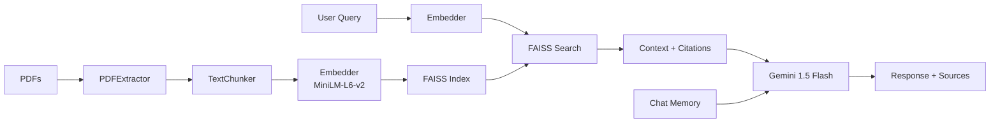

# InfoBridge T10.7 — Implementation Walkthrough

## What Was Built

A complete RAG (Retrieval-Augmented Generation) chatbot for Indian government services, implementing **T10.7** (Tier 2 — multi-service unified + Hindi support).

### Files Created (18 files)

| Module | File | Purpose |
|--------|------|---------|
| Config | [settings.py](file:///home/vikash/Desktop/git_folders/InfoBridge/config/settings.py) | Central configuration (models, chunk sizes, service categories) |
| Data Processing | [pdf_extractor.py](file:///home/vikash/Desktop/git_folders/InfoBridge/src/data_processing/pdf_extractor.py) | Extract & clean text from PDFs |
| Data Processing | [chunker.py](file:///home/vikash/Desktop/git_folders/InfoBridge/src/data_processing/chunker.py) | Split text into overlapping chunks with metadata |
| Embeddings | [embedder.py](file:///home/vikash/Desktop/git_folders/InfoBridge/src/embeddings/embedder.py) | MiniLM-L6-v2 embedding generation (384-dim) |
| Vector Store | [store.py](file:///home/vikash/Desktop/git_folders/InfoBridge/src/vectorstore/store.py) | FAISS index with service filtering & persistence |
| Retrieval | [retriever.py](file:///home/vikash/Desktop/git_folders/InfoBridge/src/retrieval/retriever.py) | Query → embed → search → format context pipeline |
| LLM | [gemini_client.py](file:///home/vikash/Desktop/git_folders/InfoBridge/src/llm/gemini_client.py) | Google Gemini 1.5 Flash client (google-genai SDK) |
| LLM | [prompts.py](file:///home/vikash/Desktop/git_folders/InfoBridge/src/llm/prompts.py) | Dual-language prompt templates (EN/HI) |
| LLM | [generator.py](file:///home/vikash/Desktop/git_folders/InfoBridge/src/llm/generator.py) | Full RAG orchestrator with citation extraction |
| Memory | [chat_memory.py](file:///home/vikash/Desktop/git_folders/InfoBridge/src/memory/chat_memory.py) | Sliding-window conversation memory |
| Frontend | [app.py](file:///home/vikash/Desktop/git_folders/InfoBridge/app.py) | Streamlit chat UI with sidebar controls |
| Scripts | [build_index.py](file:///home/vikash/Desktop/git_folders/InfoBridge/scripts/build_index.py) | One-time PDF indexing script |
| Config | [requirements.txt](file:///home/vikash/Desktop/git_folders/InfoBridge/requirements.txt) | Python dependencies |
| Config | [README.md](file:///home/vikash/Desktop/git_folders/InfoBridge/README.md) | Project documentation |
| Config | [.env.example](file:///home/vikash/Desktop/git_folders/InfoBridge/.env.example) | API key template |
| Config | [.gitignore](file:///home/vikash/Desktop/git_folders/InfoBridge/.gitignore) | Git ignore patterns |

---

## Architecture



---

## Verification Results

All pipeline components were tested with synthetic government documents:

| Test | Result |
|------|--------|
| Module imports | ✅ All 10 modules import cleanly |
| PDF extraction | ✅ [PDFExtractor](file:///home/vikash/Desktop/git_folders/InfoBridge/src/data_processing/pdf_extractor.py#16-138) works with PyPDF2 |
| Text chunking | ✅ 3 docs → 6 chunks (1000 char, 200 overlap) |
| Embedding generation | ✅ 384-dim MiniLM vectors, normalized |
| FAISS vector store | ✅ Add + search + service filtering |
| Retrieval routing | ✅ "passport" query → passport docs, "voter" → voter docs |
| Conversation memory | ✅ Sliding window, formatted history |
| Prompt templates | ✅ English + Hindi templates |
| Service filter | ✅ Correctly filters results by service category |

---

## How to Use

### Step 1: Add your Gemini API key
```bash
cp .env.example .env
# Edit .env → GOOGLE_API_KEY=your_key
```

### Step 2: Add PDFs to data folders
```
data/passport/   ← Passport PDFs
data/voter/      ← Voter ID PDFs
data/driving/    ← Driving licence PDFs  
data/tax/        ← Income tax PDFs
data/health/     ← Ayushman Bharat PDFs
```

### Step 3: Build the index
```bash
python scripts/build_index.py
```

### Step 4: Launch the app
```bash
streamlit run app.py
```

> [!NOTE]
> The **Data Team** part (collecting/downloading actual government PDFs) was excluded as requested. Place your PDFs in the `data/` subdirectories before building the index.
